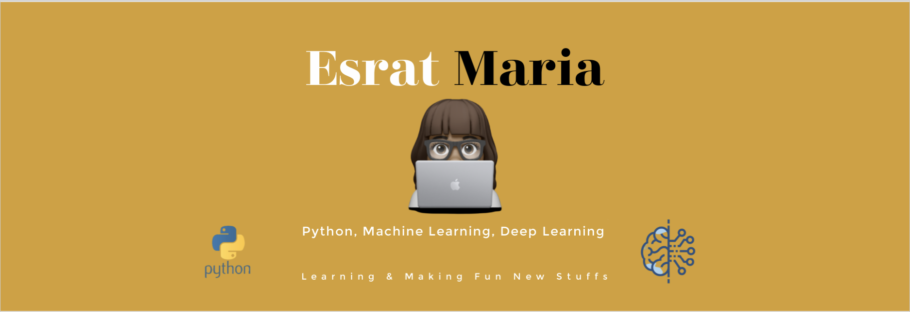

### Hey there, I'm Maria - 🙋🏽‍♀️

## I'm a Research Student and a Passionate Developer!🌺

I am originally from Bangladesh 🇧🇩 but currently living in **Seoul, South Korea 🇰🇷.** I am in my last semester of my Master degree. You can find me here on [![LinkedIn][2.2]][2] to know more about me and my works.

<!-- Icons -->
[2.2]: https://raw.githubusercontent.com/MartinHeinz/MartinHeinz/master/linkedin-3-16.png (LinkedIn icon without padding)

<!-- Links to your social media accounts -->
[2]: https://www.linkedin.com/in/esrat-maria-1598ab19a/

- 🔭 I’m currently working on **Q Learning Implementation on Edge Federated Cloud Environment**
- 🌱 I’m currently learning everything **Reinforcement Learning**
- 💬 Ask me about anything if my work featured in my repositories interest you
- 📫 How to reach me: reach me via my [Email](esrat.maria@icloud.com)
- 💻 Goals: Learn more technological stacks and improve my overall skills
- ⚡ Fun fact: A good show on **Netflix** and I am sold
- 🧡 I believe in **Open Source**

 

 

I am thankful to the contents [here](https://www.youtube.com/watch?v=ECuqb5Tv9qI) and [here](https://github.com/anuraghazra/github-readme-stats) that helped me create this.
